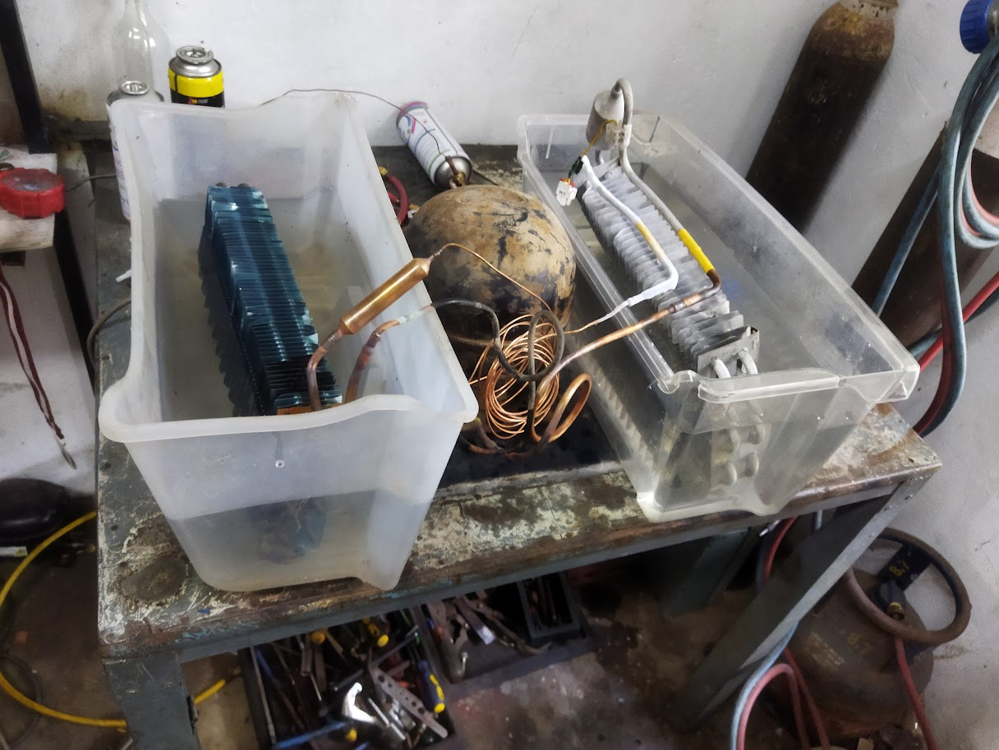
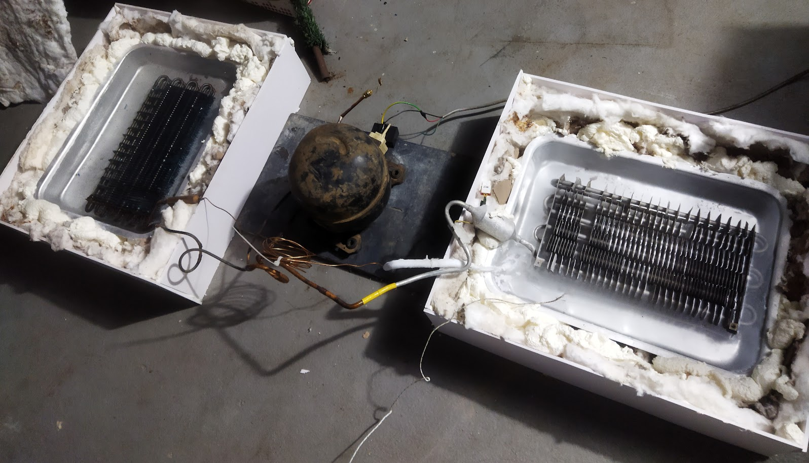
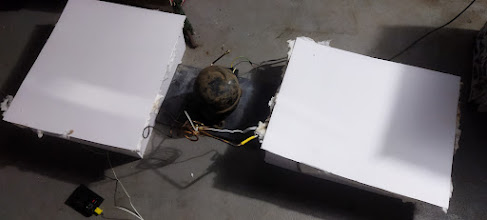

# Dual-Mode Thermal Energy Storage System


A working heat pump prototype demonstrating **simultaneous capture of cold (0–4 °C) and heat (60–90 °C)** from a single refrigerant cycle, with phase-change material (PCM) storage integrated at both ends. Theoretical dual-output COP of **7–9** (combined heating + cooling per electrical input).

---

# Overview

Conventional heat pump systems waste one side of the refrigeration cycle. A cold storage facility rejects condenser heat to atmosphere. An industrial dryer dumps the evaporator-side cold. Both pay for energy that produces two useful outputs — but capture only one.

This project demonstrates that with proper architecture, both useful outputs can be captured from a single energy input. The combination is especially relevant for agricultural and food-processing facilities in developing regions, where the same site often needs both cold storage and process heat — but cannot afford two separate systems.

---

# Highlights

- Working prototype delivering simultaneous **70 °C hot / −2 °C cold** output
- Built using salvaged domestic refrigerator compressor + custom heat exchangers in separate water reservoirs
- Designed full PCM-integrated system targeting **0–4 °C cold / 60–90 °C hot**
- Theoretical dual-output **COP 7–9** (combined heating + cooling per electrical input)
- Modular architecture: cold storage and drying modules independently or simultaneously operable
- Target applications: agricultural cold-chain + drying, food processing, building thermal services

---

# Refrigerant Selection

The first design decision was refrigerant selection. The hot-side target of 60–90 °C immediately eliminates most common refrigerants — their critical temperatures sit too close to or below the required condensing temperature.

| Refrigerant | Critical Temp | Viable at 90 °C hot side? | Notes |
|---|---|---|---|
| R134a | 101 °C | ❌ Too close to critical | Common but unsuitable |
| R290 (propane) | 96.7 °C | ❌ Exceeds critical | Would fail at target |
| **R600a (isobutane)** | **134.7 °C** | **✓ Safe margin** | Used in domestic compressors |
| R152a | 113 °C | ✓ marginal | Less accessible |

**R600a (isobutane)** was selected. It is already present in modern domestic refrigerator compressors, provides a 45 °C safety margin below its critical temperature at the target condensing condition, and has a low global warming potential.

---

# Thermodynamic Cycle Design

## Operating Conditions

| Parameter | Value | Basis |
|---|---|---|
| Evaporating temperature | −8 °C | 6–8 K below cold-side target |
| Condensing temperature | 80 °C | 10 K above hot-side mid-range target |
| Refrigerant | R600a | Selected refrigerant |

---

## Performance Calculations

```text
Refrigeration effect:   q_evap    = h₁ − h₄ = 530 − 310 = 220 kJ/kg
Heating effect:         q_cond    = h₂ − h₃ = 600 − 310 = 290 kJ/kg
Compressor work:        w         = h₂ − h₁ = 600 − 530 =  70 kJ/kg

COP_cooling   = q_evap / w          = 220 / 70  = 3.1
COP_heating   = q_cond / w          = 290 / 70  = 4.1
COP_combined  = (q_evap + q_cond) / w = 510 / 70  = 7.3
```

The theoretical COP of 7–9 is a **combined dual-output COP** accounting for both useful heating and cooling delivered from a single compressor cycle.

---

# Prototype Development & Experimental Validation

The prototype was developed to experimentally validate simultaneous useful heating and cooling from a single vapour-compression refrigeration cycle. The setup used a salvaged domestic refrigerator compressor connected to independently accessible hot and cold thermal reservoirs through custom heat exchangers.

---

## First Experiment — Concept Validation



The initial experiment focused on validating temperature separation and confirming that both hot and cold outputs could be produced simultaneously from the single compressor cycle. This was the proof-of-concept run before thermal insulation improvements were applied.

---

## Heat-Insulated Thermal Reservoir



The thermal reservoir and heating chamber were constructed using insulated enclosures lined with ceramic wool to minimise heat loss during operation. This version of the setup allowed sustained operation and more accurate measurement of steady-state temperatures at both reservoirs.

---

## PCM Integration Experiment



Phase-change material integration experiments were conducted to evaluate thermal buffering and energy storage potential within the system. The PCM-based storage concept allows thermal energy to be stored during compressor operation and released on demand, decoupling cooling/heating production from usage timing.

---

# Experimental Results

| Parameter | Result |
|---|---|
| Hot-side temperature | **~70 °C** |
| Cold-side temperature | **~−2 °C** |
| Operation mode | Simultaneous heating + cooling |
| Thermal separation | Stable across multiple runs |
| PCM integration | Feasibility confirmed |

The experiments validated the feasibility of using one compressor cycle to serve both refrigeration and heating applications simultaneously — forming the basis for the full PCM-integrated agricultural cold-chain and drying system.

---

# Full System Architecture (Design Target)

The long-term system targets:

- **Cold side:** 0–4 °C PCM (water/ice) storage
- **Hot side:** 60–90 °C PCM (stearic acid) storage
- **Modular deployment:** multiple units operating in parallel
- **Decoupled operation:** thermal storage serving loads on demand

---

# Repository Structure

```text
/prototype/   — prototype photos and build documentation
/cad/         — SolidWorks files for PCM-integrated system design
/thermo/      — thermodynamic cycle calculations and COP analysis
/pcm/         — PCM selection and sizing analysis
/docs/        — full design report
README.md
```

---

# Tech Stack

| Tool | Use |
|---|---|
| SolidWorks | Full system CAD design |
| Python | Thermodynamic calculations |
| Excel | Heat exchanger & PCM sizing |
| Hardware | Domestic refrigerator compressor, custom heat exchangers, water reservoirs |

---

# Status

Prototype built and experimentally validated with measured simultaneous hot/cold output.

Full PCM-integrated system design completed including:
- refrigerant selection,
- compressor sizing,
- heat exchanger calculations,
- and PCM integration studies.

### Next Phase
- Purpose-built compressor
- PCM-integrated reservoirs
- Field deployment for agricultural cold-chain + drying applications
